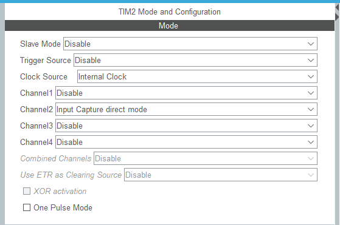
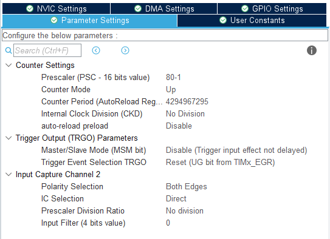
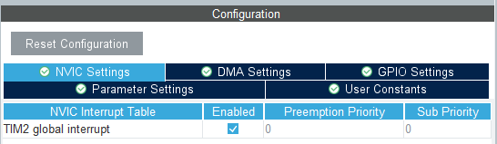

# Pulsewidth Measurement
In this addition a timer will be used to measure the high time of a pulse.

## Timer setup
Take a General Purpose Timer or Advanced Timer (preferably 32 bit). In the
example a 32-bit General Purpose Timer is used.

### Timer Mode


Any of the channels will do. Multiple can be used at once.

### Parameter settings


Set the prescaler to some known value. In this case I want to count
microseconds, so I set the clock to 1 MHz (check if your clock is on APB1 or
APB2).

Set the input capture channel to both edges. This clock will now trigger an
interrupt on a rising and a falling ege.

### NVIC Settings


Global interrupts should be enabled.

### Timer start
```c
if (HAL_TIM_IC_Start_IT(&htim2, TIM_CHANNEL_2) != HAL_OK)
{
	Error_Handler();
}
```
Each channel should be enabled seperately. An error handler is advised.

### Callback
```c
uint32_t us_time = 0;
uint32_t first_cnt = 0;
uint32_t second_cnt = 0;
  
uint8_t first_capture = 1;

void HAL_TIM_IC_CaptureCallback(TIM_HandleTypeDef *htim)
{
	if(htim->Channel == HAL_TIM_ACTIVE_CHANNEL_2)
	{
		if(first_capture)
		{
			first_cnt = HAL_TIM_ReadCapturedValue(htim, TIM_CHANNEL_2);
			first_capture = 0;
		}
		else
		{
			second_cnt = HAL_TIM_ReadCapturedValue(htim, TIM_CHANNEL_2);
			first_capture = 1;
			printf("first: %lu\nsecond: %lu\ndifference: %lu\n", first_cnt, second_cnt, second_cnt-first_cnt);
		}
	}
}
```
A simple callback to count the amount of microseconds between a rising and a
falling edge.

> [!NOTE]
> A timer overflow is not taken into account in the above snippet.